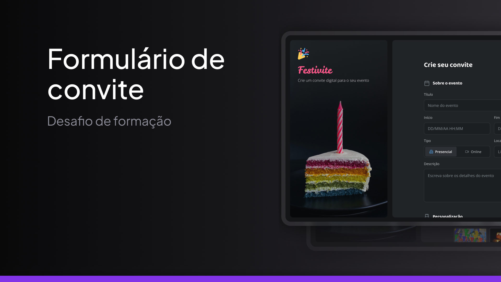

<h1 align="center"> Desafio - Festive Page </h1>

Uma página de formulário de criação de um convite feita como forma de um desafio do curso Fullstack da Rocketseat

<a href="https://guilhermedkdk.github.io/page-festive/">🔗 Live Preview</a>&nbsp;&nbsp;&nbsp;|&nbsp;&nbsp;&nbsp;
<a href="#-tecnologias">🚀 Tecnologias</a>&nbsp;&nbsp;&nbsp; |&nbsp;&nbsp;&nbsp;&nbsp;
<a href="#-aprendizados">📚 Aprendizados</a>

## 🚀 Tecnologias

Esse projeto foi desenvolvido com as seguintes tecnologias:

- HTML e CSS
- Git e Github
- FIGMA

## 📚 Aprendizados

Este projeto foi feito como forma de um desafio dentro do curso de Fullstack no módulo "HTML e CSS Avançado" da Rocketseat. Nele pude consolidar os conhecimentos sobre:

### HTML
- Forms
- Inputs
